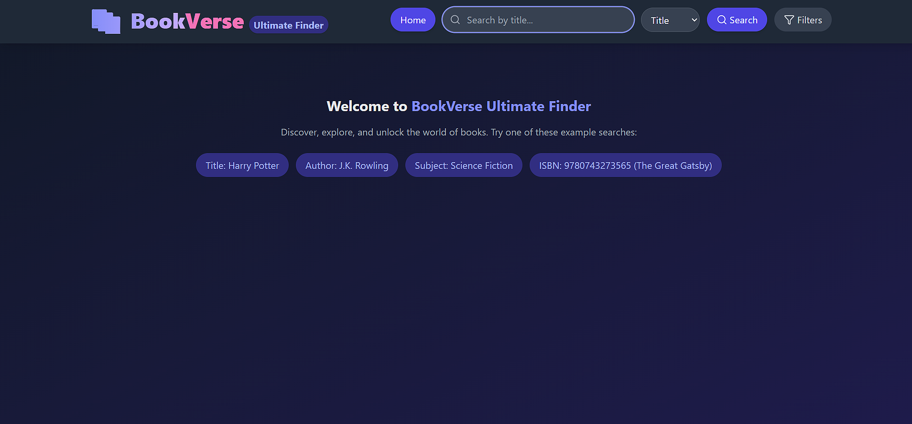

# 📚 BookVerse Ultimate Finder  

A modern and responsive book search application built with **React, Vite, and Tailwind CSS**.  
Uses the **OpenLibrary API** to let users search, explore, and discover books effortlessly.  

---

## 🔥 Features
- ✅ Search books by **title, author, or subject**  
- 📖 View key book details (title, author, first publish year, edition count)  
- 📱 Fully responsive (mobile, tablet, desktop)  
- ⚡ Lightning-fast with **Vite build**  
- 🎨 Sleek and minimal UI with **Tailwind CSS**  

---

## 🛠️ Technologies Used
- ⚛️ React.js  
- ⚡ Vite  
- 🎨 Tailwind CSS  
- 📖 OpenLibrary API  

---

## 🌐 Live Demo
👉 [View BookVerse Ultimate Finder](https://bookverse-ultimatefinder.netlify.app/)  

---

## 🚀 Installation & Setup  

To run the project locally, follow these steps:  

1. **Clone the repository**  
    ```bash
    git clone https://github.com/ahmedullah-dev/bookverse-ultimate-finder.git
    cd bookverse-ultimate-finder
    ```

2. **Install dependencies**  
    ```bash
    npm install
    ```

3. **Run the project**  
    ```bash
    npm run dev
    ```

The app will be available at **http://localhost:5173**.  

---

## 📸 Preview
  

---

## 🔮 Future Enhancements
- Add **filters** by publish year, language, or genre.  
- Implement **pagination or infinite scroll** for large result sets.  
- Allow users to **save favorite books**.  
- Add **dark mode toggle** for better accessibility.  
- Show more **detailed book info** (e.g., description, subjects).  

---

## 🧑‍💻 Author
**Ahmed Ullah**  

- 💼 [LinkedIn](https://www.linkedin.com/in/ahmedullah-dev)  
- 💻 [GitHub](https://github.com/ahmedullah-dev)  
- 🌐 [Portfolio](https://ahmedullah-dev.netlify.app/)  
